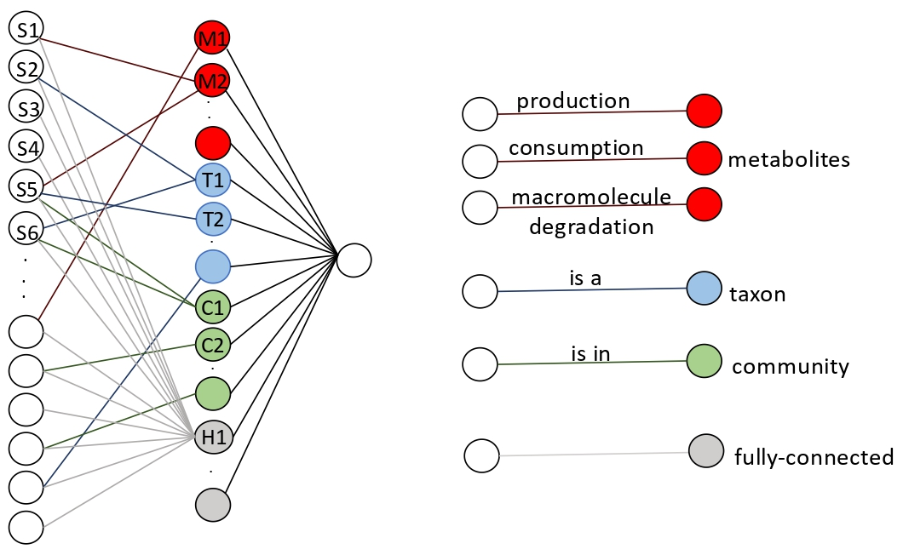

# MicroKPNN
 MicroKPNN is a knowledge-primed neural network for microbiome-based human host phenotype prediction.
 
 The prior-knowledge used in MicroKPNN includes the metabolic activities of different bacterial species, phylogenetic relationship and bacterial community information. 
 
 The structure of the neural network is as shown in the figure below: 
 
 
 
 ### System requirements
 
 MicroKPNN was developed on Ubunto and all scripts are in python. 
 
 ### Installation
 
 First you have to create a conda environment and install the required packages as following:

 ```
 conda create -n MicroKPNN python=3.7 tensorflow=1.13 pandas=0.24 numpy=1.16 scipy=1.2 psutil=5.6
 conda activate MicroKPNN	
 conda install -c conda-forge pytables=3.5
 conda install -c bioconda biom-format 
 conda install networkx
 
 ###for Analysis part
 conda install -c anaconda scikit-learn
 conda install -c conda-forge matplotlib
 ```
 If you are not able to install the biom-format using above command, use the following one instead:
 ```
 conda install -c bioconda -c conda-forge biom-format
 ```
 
 Installation instructions:
 
 ```
 git clone https://github.com/mgtools/MicroKPNN.git
 cd MicroKPNN/
 ```
 ### Demo to use the MicroKPNN tool
 In this repo we provide example datasets for you to use and their outputs in single_output and output directories.
 
 Required inputs for this tool:
 1. A .biom file (eg. output of kracken bracken) which contains species (with taxonomic assignment) and their relative abundances across the samples. You can see ExampleDataset/bracken.biom (unzip bracken.biom.tar.gz) to see how your input should look like. For more info about biom dataset, you can check out https://biom-format.org/.
 2. A .csv file with metadata information of the samples. It has a column called "Sample Accession or Sample ID" for sample ids, and a column called "Phenotype" that has phenotype information for each sample. The healthy samples should be labeled as "Healthy" (with capital H). Here is a sample file:   ExampleDataset/Supplementary_Table.csv.
 3. The phenotype you want to use. 
 
 Optional inputs:
 
 4. --taxonomy <number>
 
     0: kingdom
     1: phylum
     2: class
     3: order
     4: famiy
     5: genus
 
 5. --h <number>: the number of unknown hidden nodes you want to use in the hidden layer
 
 6. --thread <number>: the default is 1

 
 **Single output version:**
 
 In this version you specify which taxonomic rank and what number of unknown hidden neurons you want to use for your interpretable neural netwok. In the following example we use kingodm(0) and 10 unknown hidden nodes. 
 
 
 ```
 mkdir single_output
 python MicroKPNN.py ExampleDataset/bracken.biom ExampleDataset/Supplementary_Table.csv Obesity single_output --taxonomy 0 --h 10 --threads 2

 ```
 
 **All combination output version:**
 
 In this version you just run the following command and it produces the results for all combinations of all taxonomic ranks and unknown hidden nodes that we define as follow:
 
 taxonomy = [kingdom, phylum, class, order, family, genus]
 
 unknown hidden nodes number = [10, 20, 30, 40, 50, 60, 70, 80, 90, 100]

 Therefore in the end, you'll have 60 different output results.
 ```
 mkdir output
 python MicroKPNN.py ExampleDataset/bracken.biom ExampleDataset/Supplementary_Table.csv Obesity output --threads 2
 ```

 ### Analysis
Depending on the number of combinations and weather you want to have the accuracy for one run or average acccuracy of multiple runs, it creates Analaysis dir in your output directory and puts the results there. 

If you run for a single combination you would have a csv file in your Analysis directory which contains one line.

If you run it for all the combinations then your Analysis directory would contain a csv file with results for all the combinations and also there is a plot directory containing plots showing the comparison of different taxonomy with the same number of hidden nodes number, and comparison of different numbers of unknown hidden nodes using the same taxonomic rank.    
 
 ```
 python accuracy.py <for 1 combination or all combination> <number of runs> <outputDir>
 ```
 
 <for 1 combination or all combination>: 1 for one combination in your outputDir and 2 for all combinations in you outputDir:
  
  <number of runs>: If you run MicroKPNN more than once you have more than one run results and then you can get the average of them 
  
  Example for one combination:
   
  ```
  python accuracy.py 1 1 single_output/
  ```
   
  Example for all combination and number of runs equal to 2:
   
  ```
  python accuracy.py 1 1 single_output/
  ```
   
 You can also create a plot to see which of the hidden nodes play an important role for predicting the phenotype.
   
 ```
 python impNodes_boxplot.py <inputNetworkDir> <inputResultDir> <outputDir> <number of runs>
 ```
   
  <inputNetworkDir>: path to directory containing edges info
  
  <inputResultDir>: path to directory containing runs
   
  <outputDir>: path to directory wants the results saved
  
  <number of runs>: If you run MicroKPNN more than once you have more than one results and then you can get the average of them
   
   
 Example: 
   
 ```
 python impNodes_boxplot.py output/NetworkDir/kingdom10 output/Results/kingdom10 output/Analysis/ 2
 ```
 ### Instructions on how to run MicorKPNNs on your data
Based on our results the genus rank generally gives good results. If you don't want to try all combinations of the hyperameters (taxonomic rank and number of unknown hidden node) to find the best one you may go with genus.  
 
Runtime: If you use a computer with GPUs, it does help. It takes about 1 hour to run for one combination, and it may take up to 40 to 50 hour to run for all combinations if you use GPU. 
 

